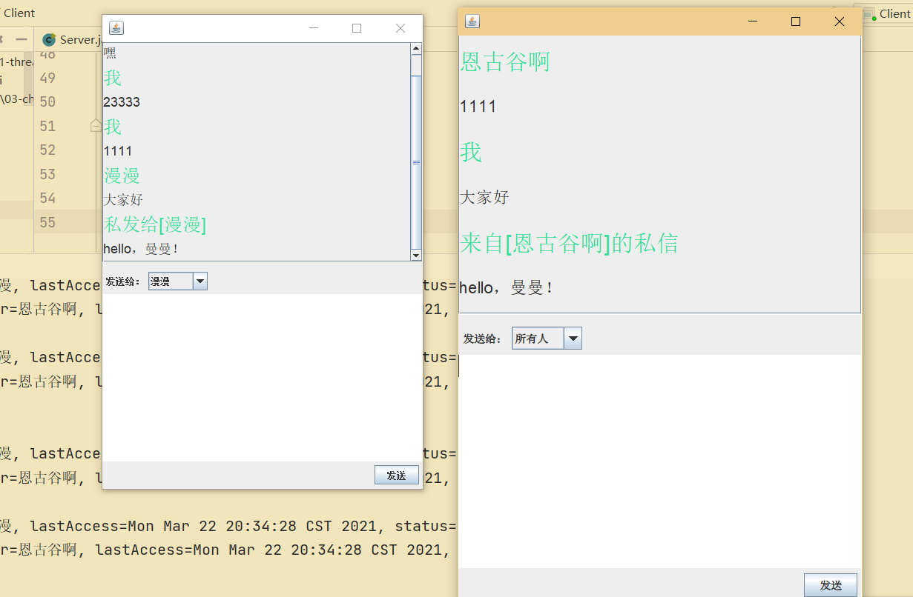

# chatroom

a simple chatroom by java through multi-thread, swing, socket


## 练习的知识点

1. volatile + synchronized。原子性、可见性。(volatile 只有一处，Client.java 中)
2. socket。（对socket的封装类 MySocket。关闭流同时会关闭socket，因此数据收发后手动关闭）
3. 多线程。同步问题
4. swing。JScrollPane实现滚动聊天框，消息框的固定（使用的JLable，大小不固定）


## C/S 功能概括

#### 1. Client角度

1. 用户发送消息时将消息放入消息缓冲区（登陆后）
2. 后台定时请求服务端（每200ms一次，首先读取消息缓冲区将信息封装成数据包进行发送，其次接收服务端发来的数据包后更新 UI）

#### 2. Server角度

1. 接收数据包的线程将数据包放入数据包缓冲区，并将信息缓冲区中用户的信息发送给用户
2. 解析数据包的线程从数据包缓冲区中获取并解析数据包，将信息放入信息缓冲区


## C/S 实现

#### 1. Client角度

1. **ClockPlan** 线程定时将信息缓冲区的内容发送至服务端，同时接收到服务端发来的数据（在线用户和收到的信息）更新 UI
2. **主线程** 将UI的处理结果（信息包）放入信息缓冲区

#### 2. Server角度

1. **AcceptThread** 线程接受用户的连接（serversocket.accept( )）
2. **SocketHandlerThread** 线程完成 socket业务。首先读取客户端发来的数据包，分类处理（可能是客户登录，也可能是客户发的信息包），然后将在线用户和用户消息封装成消息包发送给用户。（accept( )后）
3. **CheckThread** 线程检查用户状态。如果 最近一次请求（lastAccess ）与当前时间超过 1 s则标记该用户为 "OFFLINE"，同理如果用户二次登录，会标记为“ONLINE”
4. **TaskMaker** 线程分发消息。A用户发送给B用户的消息放在数据包缓冲区的数据包中，而本线程的任务就是解析数据包缓冲区中的数据包，将其放入用户信息缓冲区。


## 缓冲区

- 数据包（或信息）缓冲区

```java
//E=MyPackage或者E=Msg
public class MyTaskQueue<E> {
    LinkedList<E> list;
    //crud...
}
```


- 用户信息缓冲区

```java
//<K,V>, K=userName, V=UserInfo(..)
public class AllUsersInfo {
    HashMap<String, UserInfo> infos;//所有用户的全部信息
    //....
}

/////////////////////

public class UserInfo {
    User user;//账号、姓名
    Date lastAccess;//上次何时登录
    MyStatus status;//是否在线
    MyTaskQueue<Msg> taskQueue;//收到的消息
    //....
}

///////////////////
public class User {
    private String userName;//账号
    private String realName;//真实姓名
    //....
}
```


## 信息 & 数据包

- Msg

```java
public class Msg {
    String from;//发送者
    String to;//私发或者群发
    String targets;//私发/群发, someone/all
    String tex;//发送的文本
}
```

- MyPackage

```java
public class MyPackage {
    Integer type;//包类型，登录信息包1、发送消息信息包2、服务端消息包3
    User user;//登录信息包
    Msg[] msgs;//来往消息
    String msg;//服务器响应信息， ok/noway
    User[] users;//在线用户列表
}
```


- 截图




